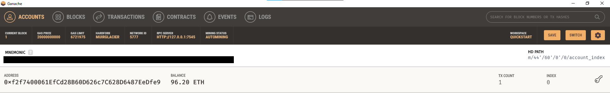

# Cryptocurrency Wallet

This repository contains code for a Streamlit application for generating a digital wallet, accessing Ethereum account balances, and signing and sending transactions via a personal Ethereum blockchain using Ganache. The transcations are centered around paying a Fintech professional an hourly rate from the generated wallet address to the selected professional's wallet address. In the Streamlit app, the user can select the professional they would like to use, and input the number of hours of work required. Below is a screenshot of the application page with a a completed transcation.

To verify the transcation was completed from the user's wallet address to the professional's wallet address, the transcations can be viewed on Ganache. 

The screenshot below shows the account information for the user's wallet address. As shown, there was one transaction ("TX COUNT") tallied on the right hand side of the screen. For 20 hours of work at the rate of 0.19 ETH per hour, the total cost of the work was 3.8 ETH (shown in the application screenshot above). With an original starting balance for the user of 100 ETH, after the 3.8 ETH transaction the resulting wallet balance is 96.2 ETH as shown below.

In the transcation history section of Ganache, the 3.8 ETH transaction is verified in the screenshot below. The "FROM ADDRESS" matches that of the user, the "TO CONTRACT ADDRESS" matches that of the Fintech professional, and the "TX HASH" matches the "Validated Transcation Hash" generated in the application.  

